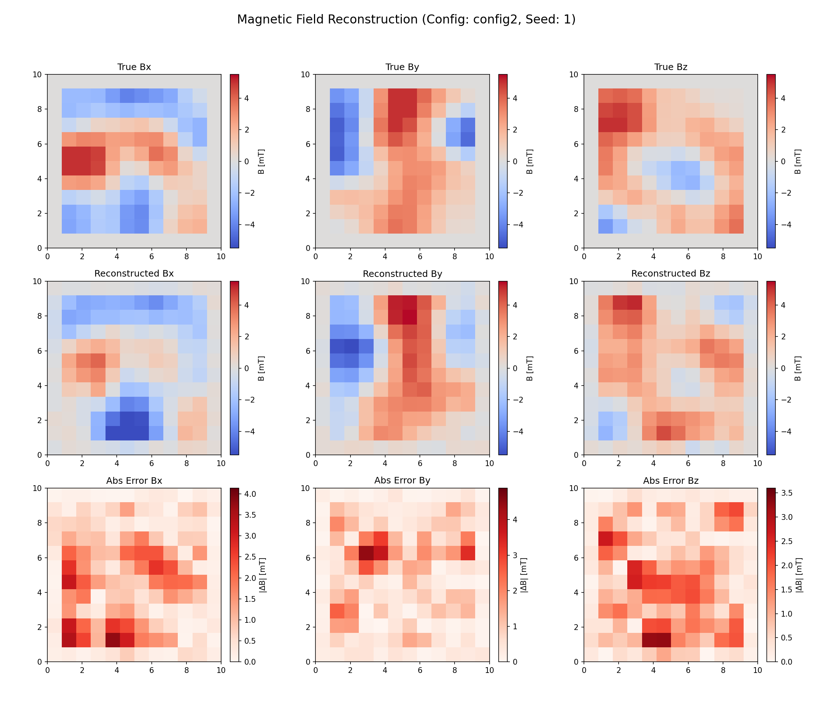

# Neutron Spin Forward Model - v0.1 (GPU Optimized)

This repository contains a high-performance, GPU-accelerated pipeline for magnetic field reconstruction using neutron spin precession. 

Version 0.1 introduces a unified, configuration-driven architecture that resolves the CPU bottlenecks found in earlier versions.

## 🚀 Key Features in v0.1
- **GPU-Accelerated Data Generation**: Replaced SciPy CPU filters with PyTorch GPU convolutions.
- **Optimized Data Layout**: Transitioned to zero-transpose loading for training, eliminating system RAM thrashing.
- **Configurable Architecture**: Full control over model capacity (spatial pooling, hidden dimensions) via JSON profiles.
- **Legacy Support**: Backwards compatibility for models trained on older CPU-optimized architectures.
- **Enhanced Visualization**: Advanced side-by-side model comparison and sinogram analysis tools.

## 📊 Example Reconstruction (Seed 1)
Below is an example of the high-capacity model (`config2.json`) reconstructing a complex magnetic field from synthetic neutron data.



## 🛠️ Environment Setup
It is recommended to use a virtual environment:
```bash
python3 -m venv .venv
source .venv/bin/activate
pip install -r requirements.txt
```

### 🔨 Build C-Extensions
The pipeline uses a fast C-extension for ray tracing. Build it using:
```bash
python setup_ray_wrapper.py build_ext --inplace
```

## ⚙️ Configuration
All hyperparameters for data generation and model training are managed via JSON configuration files. 

- `config1.json`: Default baseline (CPU-optimized legacy settings).
- `config2.json`: High-capacity GPU settings (better resolution and accuracy).

You can specify which config to use for any script using the `--config` flag:
```bash
python generate_data.py --config config2.json
```

## 🏃 Execution Pipeline

### 1. Data Generation
Generates synthetic datasets natively on the GPU. Defaults to `config1.json`.
```bash
python generate_data.py
```

### 2. Training
Trains the model. Defaults to `config1.json`.
```bash
python train.py
```

### 3. Reconstruction & Testing
Evaluate a trained model on a single test case with detailed plots.
```bash
python reconstruct.py --config config.json
```

### 4. Model Comparison
Compare two different models/configs side-by-side on the same seed.
```bash
python compare_models.py --configA config.json --modelA models/old_model.pth --configB config2.json --modelB models/new_model.pth
```

## 📊 Verification Tools
- `interactive_viewer.py`: Visually inspect the generated neutron polarization data.
- `test_compare.py`: Verify numerical equivalence between CPU and GPU backends.

---
*For the original CPU-only scripts, please refer to the `v0.0.6` tag.*
