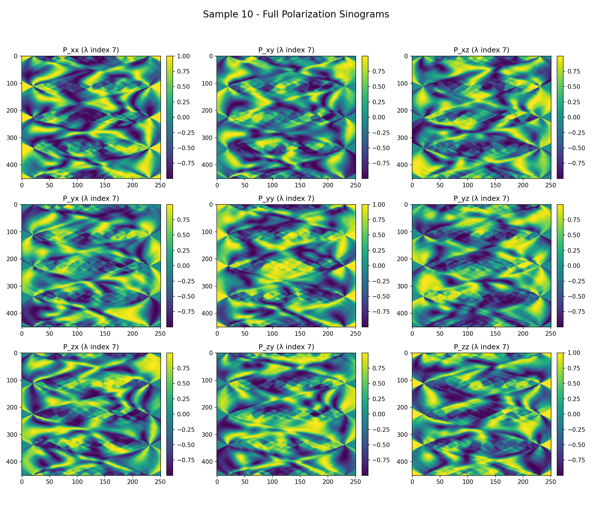
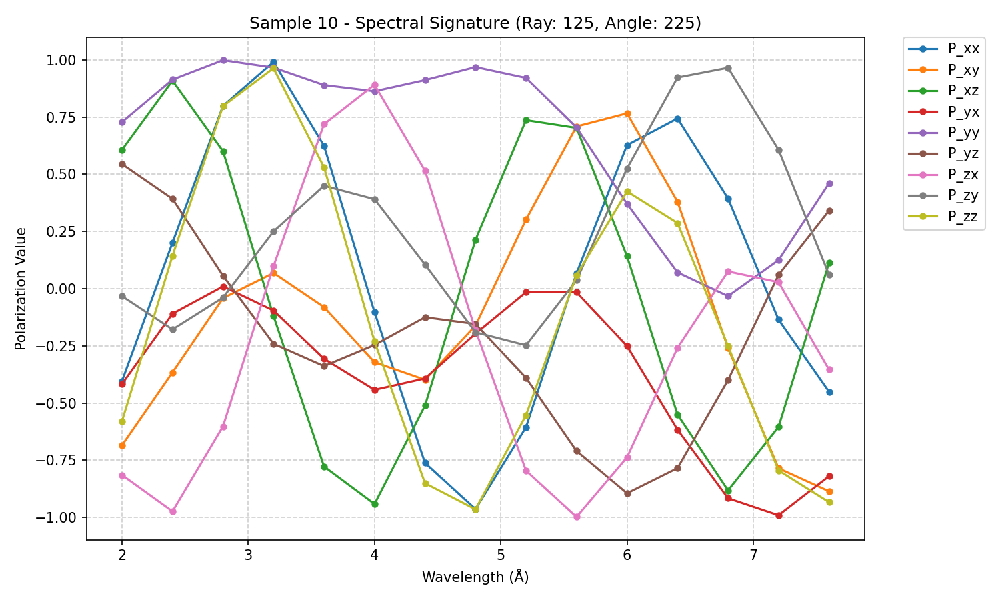
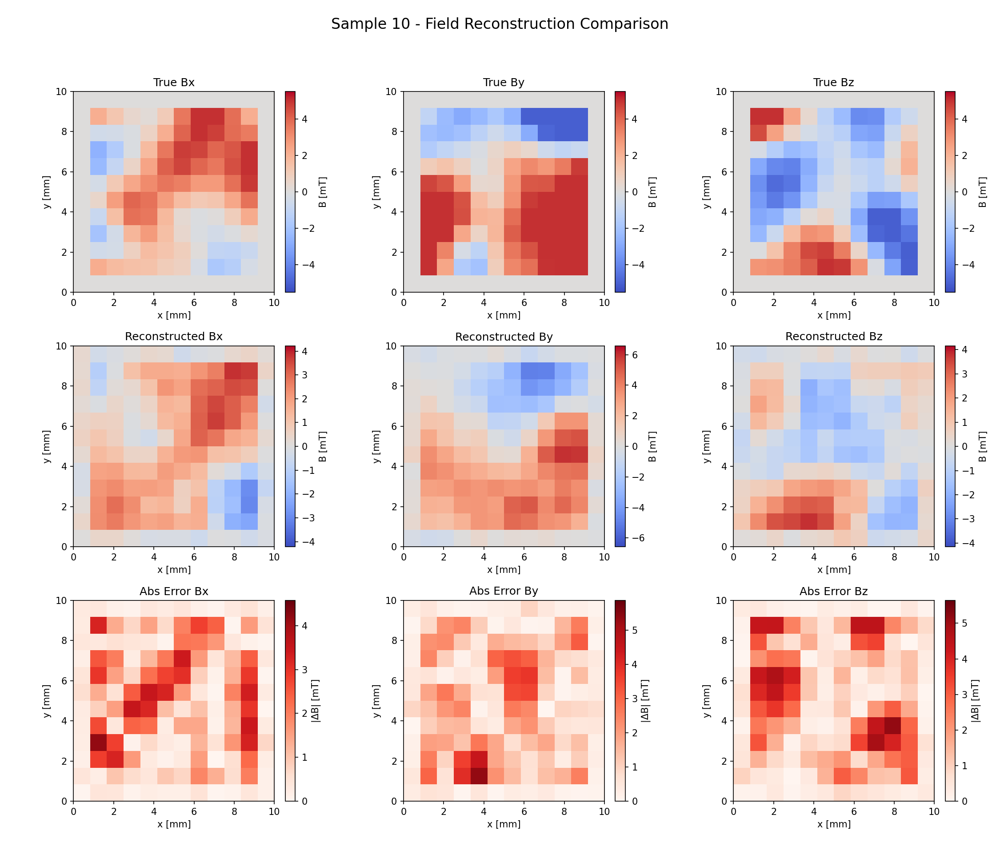

# Technical Report: 12x12 Neutron Magnetic Field Reconstruction

This document provides a comprehensive overview of the methodology, physical background, and reproduction protocol for the 12x12 resolution neutron spin precession reconstruction project.

## 1. Introduction

Neutron polarimetric tomography is a powerful technique for the non-destructive imaging of internal magnetic fields in bulk materials. As neutrons possess a magnetic moment, they undergo Larmor precession when traversing a magnetic field. By measuring the change in the neutron's spin polarization state after transmission, the integrated magnetic field along the trajectory can be inferred. This project implements a high-performance deep learning pipeline to reconstruct the 3D magnetic field vector at each voxel of a 12x12 grid.

## 2. Physical Framework

### 2.1 Larmor Precession and Rotation Matrices
The evolution of the neutron spin $\mathbf{S}$ in a magnetic field $\mathbf{B}$ is governed by the Bloch equation:
$$\frac{d\mathbf{S}}{dt} = \gamma (\mathbf{S} \times \mathbf{B})$$
where $\gamma$ is the gyromagnetic ratio. Over a path length $L$, this results in a rotation of the spin vector by an angle $\phi$:
$$\phi = c \cdot \lambda \cdot \int |\mathbf{B}| dl$$
In our numerical implementation, we model this as a sequence of discrete rotations using the **Rodrigues' Rotation Formula**. For each voxel step $i$, the rotation matrix $R_i$ is given by:
$$R_i = I + (\sin \phi_i) K + (1 - \cos \phi_i) K^2$$
where $K$ is the cross-product matrix of the unit magnetic field vector $\hat{\mathbf{B}}$.

### 2.2 Forward Model
The total precession matrix $P$ for a single neutron trajectory is the ordered product of rotations through $max\_len$ voxels:
$$P = \prod_{i=1}^{max\_len} R_i$$
We use a vectorized forward model implemented in PyTorch to calculate these matrices across hundreds of neutrons and angles simultaneously, utilizing the gyromagnetic constant scaled by wavelength ($c \approx 4.632 \times 10^{14}$).

## 3. Methodology

### 3.1 Synthetic Dataset Generation
The generation process produces physically plausible continuous magnetic fields. The following parameters are **representative examples** used for the 12x12 grid, but can be adjusted in `generate_data.py`:

- **Source**: White noise sampled on a 10x10 grid (centered in the 12x12 volume).
- **Smoothing**: Application of a Gaussian filter ($\sigma = 1.2$) to ensure vector field continuity.
- **Normalization**: Fields are typically clipped to a maximum magnitude (effective example: $minmax\_B = 5 \times 10^{-3} \text{ T}$).

### 3.2 Computational Optimization (Memory Mapping)
A 500-sample dataset with the configuration below (e.g., 251 neutrons, 451 angles, 15 wavelengths) results in a precession tensor of shape `(num_samples, nNeutrons, nAngles, nWavelengths, 3, 3)`. For our 12x12 setup, this occupies approximately **30.5 GB** of memory.

## 4. Deep Learning Architecture: Spin2DNet

The reconstruction task is handled by `Spin2DNet`, a specialized architecture designed for CPU-efficient sinogram-to-image translation:

1.  **Encoder**: A series of 2D convolutional layers extract local spectral features from the 135-channel input (9 polarization components $\times$ 15 wavelengths).
2.  **Bottleneck**: Adaptive average pooling reduces the spatial dimensions of the sinogram features to a fixed $18 \times 6$ representation.
3.  **Domain Transform**: Fully connected layers map the flattened features into the $12 \times 12 \times 3$ image space, effectively learning the inverse of the Radon-like magnetic transform.
4.  **Refinement**: Final 2D convolutions enforce spatial consistency and smooth the reconstructed vector field components ($B_x, B_y, B_z$).

## 5. Reproduction Protocol

### 5.1 Environment Setup
Install the necessary dependencies. It is recommended to use a virtual environment:
```bash
python3 -m venv .venv
source .venv/bin/activate
pip install -r requirements.txt
```

### 5.2 Building the Ray Tracer
The C extension for fast ray-voxel intersection must be compiled locally:
```bash
python setup_ray_wrapper.py build_ext --inplace
```

### 5.3 Execution Pipeline
Follow these steps in order to reproduce the 12x12 results:

1.  **Generate Data**:
    ```bash
    python generate_data.py
    ```
2.  **Train Model**:
    Trains on the first 80% of the generated data (default split).
    ```bash
    python train_model.py --epochs 50 --train_split 0.8
    ```
3.  **Evaluate and Visualize**:
    Evaluates exclusively on the remaining 20% of unseen data.
    ```bash
    python evaluate_results.py --train_split 0.8
    ```

## 6. Example Results

### 6.1 Input Data (Sinograms and Spectra)
The following sinograms show the full polarization components ($P_{xx}$ to $P_{zz}$) measured for a single wavelength. The spectral curves track the precession signal across all 15 wavelengths for a central ray.




### 6.2 Reconstruction Fidelity
Below is an example of the true vs. reconstructed magnetic field components ($B_x, B_y, B_z$) for the $12\times12$ resolution grid.



## 7. Conclusion
The detailed evaluation plots (e.g., `results/reconstruction_sample_10.png`) provide a component-wise comparison of the true and reconstructed fields. The model typically achieves high fidelity in recovering the smooth topological features of the magnetic vector field, demonstrating the effectiveness of the convolution-to-linear domain mapping for neutron polarimetric reconstruction.

## 8. Scaling for Improved Fidelity

To achieve higher reconstruction accuracy or handle more complex magnetic field geometries, the following parameters in `generate_data.py` can be adjusted:

### 8.1 Dataset Diversity (`num_samples`)
Increasing the number of training samples (e.g., to 2000+) is the most direct way to improve generalization. This reduces artifacts and improves the model's robustness to unseen field configurations. Note that larger datasets require more training epochs to converge.

### 8.2 Spectral Resolution (`wavelengths`)
Adding more wavelength points (e.g., reducing the step to 0.2 Å) provides the model with more phase information. This is critical for high-field reconstructions where the spin might undergo multiple $2\pi$ rotations, as it helps the model "unwrap" the precession signal more reliably.

### 8.3 Measurement Density (`nAngles`, `nNeutrons`)
Increasing the number of projection angles or neutrons per angle increases the resolution of the input sinogram. Because `Spin2DNet` uses adaptive pooling, the architecture automatically scales to accommodate larger input dimensions without modification.

### 8.4 Field Complexity (`sigma`)
The Gaussian smoothing factor `sigma` in `generate_smooth_b_field` controls the spatial frequency of the generated fields. Reducing this value (e.g., to 0.8) produces fields with sharper features, which can be used to train a model capable of reconstructing more intricate magnetic structures.
