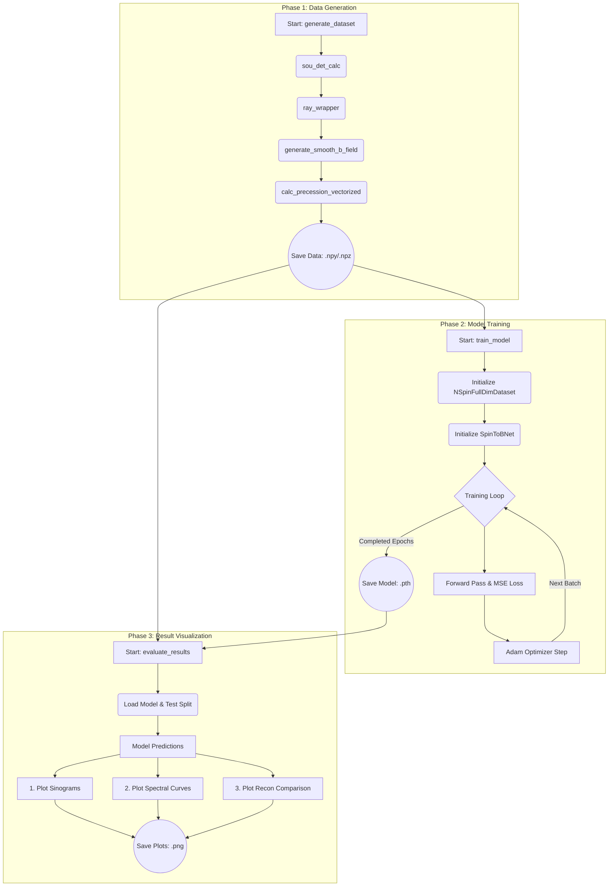

# Neutron Spin Forward Workflow

This document outlines the detailed workflow of the 12x12 neutron spin precession reconstruction project. The pipeline comprises three major phases: generating synthetic datasets, training a deep neural network, and visualizing the evaluation results.

## Workflow Overview

---

## 1. Data Creation (`generate_data.py`)

The data generation process produces physically plausible synthetic magnetic fields and numerically simulates the Larmor precession for neutrons traveling through them. It is executed via the `generate_dataset()` entry point.

**Function Execution Order & Details:**

1.  **`sou_det_calc()`**: 
    Calculates the geometric coordinates for the neutron beams. It computes the ray source and detector intersections given the grid size, scaling factor, and discrete projection angles.
2.  **`ray_wrapper.ray_wrapper()`**: 
    A compiled C-extension function called for each source-detector ray pair. It performs high-speed ray-voxel intersections, determining exactly which voxels each ray passes through, returning indices (`voxel_index`) and traversal lengths (`voxel_data`).
3.  **`generate_smooth_b_field()`**: 
    Generates the target variables (the "A Data"). Random 3D Gaussian noise is constructed on a grid, smoothed out using a Gaussian filter (`sigma=1.2`) to create a continuous vector field, and clipped to a physical domain maximum magnitude ($5 \times 10^{-3}$ T).
4.  **`calc_precession_vectorized()`**: 
    The core PyTorch-based forward model simulation. Run in batches to manage memory, it takes the generated B-fields and precomputed geometry to calculate the complete series of Larmor spin rotations (the $3\times3$ polarization matrix $P$) for every angle, neutron ray, and wavelength. The results are stored efficiently on disk using Numpy's memory-mapping (`open_memmap`).
5.  **Data Export**: 
    All generated artifacts are saved to the `data/` directory: magnetic field labels (`A_data_...npy`), the resulting measurement sinograms/spectra (`B_data_...npy`), and simulation parameters (`meta_...npz`).

---

## 2. Model Training (`train_model.py`)

This script supervises the network architecture learning process. By default, it isolates the first 95% of the data to perform the optimization gradient updates.

**Function Execution Order & Details:**

1.  **`train()`**: 
    The primary routine that prepares resources, determines lengths for the data split, and initiates the device (CPU/GPU).
2.  **`NSpinFullDimDataset` Initialization**:
    A PyTorch Dataset abstraction wraps over the `A_data` and `B_data` arrays, starting from index `0`. This wrapper normalizes data fields during runtime before packaging them into random minibatches using the `DataLoader`.
3.  **`SpinToBNet` Initialization**:
    Dynamically configures the full deep learning architecture dimensions (channels, measurement rays, image scale). The structure relies on multiple convolutional encoders to extract local features. **Dimensionality reduction** is performed using an Adaptive Average Pooling bottleneck (`nn.AdaptiveAvgPool2d`). This drastically compresses the large spatial dimensions of the sinogram feature maps (from potentially hundreds of thousands of features) into a fixed, manageable representation of $18 \times 6$. This pooling step guarantees CPU-efficient sizes before passing data into the final linear domain-transform layer, mapping directly to a $12\times12$ parameter grid layout.
4.  **Training Loop Execution**:
    For the specified number of epochs, batches iteratively flow through the network (`model(xb)`).
    - **Backpropagation**: Calculates differences using Mean Squared Error (`nn.MSELoss()`).
    - **Optimization**: Updates gradient weights universally utilizing the Adam Optimizer (`opt.step()`).
5.  **Model Export**: 
    The post-training model weights are serialized as a state dictionary and output to `models/spin2b_12x12.pth` for permanent safe-keeping and downstream evaluation.

---

## 3. Result Visualization (`evaluate_results.py`)

This final stage verifies the precision of the trained layout against the 5% held-out test split, focusing heavily on visualizing domain metrics directly comparable to experiments.

**Function Execution Order & Details:**

1.  **`evaluate()`**:
    The main testing routine parses the leftover dataset chunk mapping index limits directly to the `NSpinFullDimDataset` boundary constraints. Base measurement properties (un-normalized factor domains and metadata scalars) get parsed simultaneously.
2.  **Load Pretrained Weights**:
    The system reinitializes a matching, blank `SpinToBNet` and layers the tested `.pth` parameters over it using `model.load_state_dict()`. `model.eval()` prevents future weight changes mid-flight.
3.  **Prediction Generation**:
    Using `torch.no_grad()`, selected slices are queried. Reconstructed continuous features (`pred`) and true generated datasets (`xa`) are scaled back to practical sizes (milliteslas).
4.  **Render Outputs (via `matplotlib.pyplot`)**:
    Calculates detailed comparison metrics exported as files in `results/examples/` corresponding to representative data indices.
    - **Sinogram Gallery**: Formats a $3\times3$ grid displaying the 9 polarization elements measuring cross-sectional field rotations for a centrally anchored spectrum wave value.
    - **Spectral Curves**: Traces the unique sequence oscillations as rays experience varying $2\pi$ wrap conditions corresponding identically against scanning wavelength shifts.
    - **Reconstruction Comparison Chart**: Computes Absolute Error variables representing algorithmic degradation. Plots comparative heat maps displaying Ground Truth, Output Guess, and Difference mapping for all vector directions (Bx, By, Bz) side-by-side using the identical physical dimension limits (`extent`).
